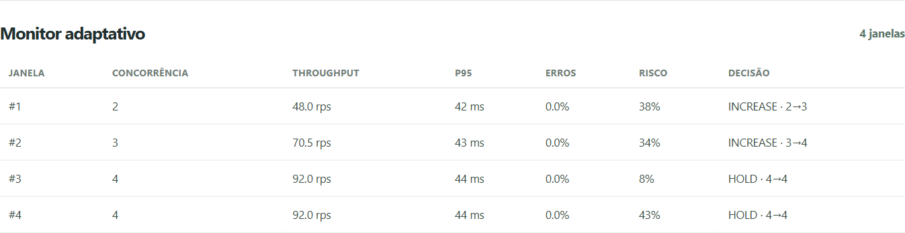
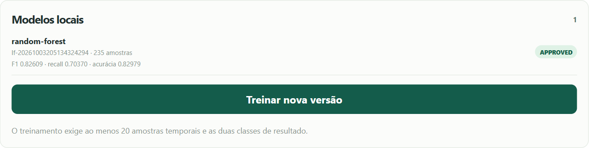
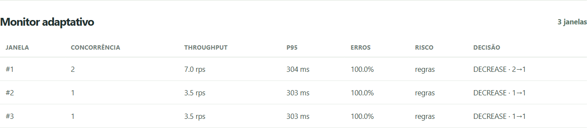
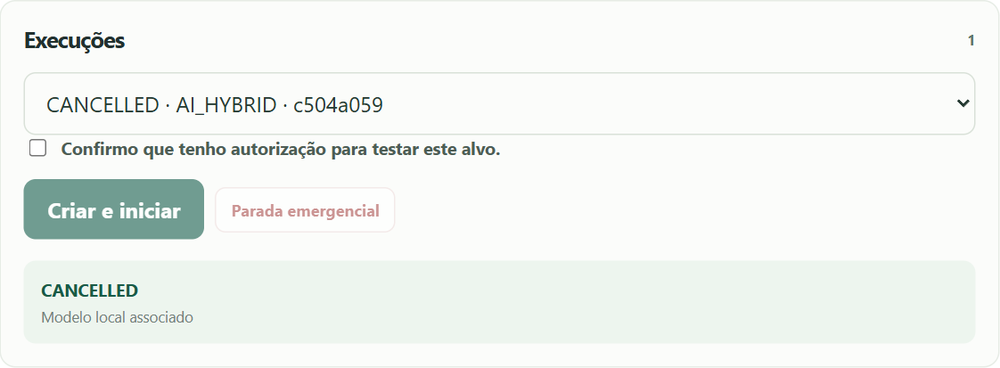

# Evidências da Sprint 05

Data da verificação: 03/10/2026. Ambiente local isolado: Docker, PostgreSQL 16, API FastAPI, interface React e alvo HTTP controlado pela equipe. Não houve carga em serviços externos.

## Funcionalidades e persistência

O [registro das rotas reais](fluxo-api.json) contém o fluxo de criação, coleta FIXED de 480 segundos, treinamento, aprovação, execução híbrida, erros, timeouts, cancelamento e consulta após reiniciar a API. Não inclui login, tokens, senhas ou cabeçalhos de autenticação.

| Item | Registro | Resultado |
|---|---|---|
| Modelo aprovado | `27d485d8-d171-4596-837a-8d40d825ad05` | Random Forest; 235 amostras; F1 0,82609, recall 0,70370, acurácia 0,82979. |
| Execução híbrida | `a45e7cef-db67-4ba4-a903-507ca824b2b5` | Quatro janelas, quatro previsões e quatro decisões vinculadas. |
| Reinício da API | `restart_recovery` no JSON | Mesmos IDs, estado COMPLETED e valores das janelas. |
| Treino insuficiente | HTTP 409 antes de terminar a coleta | Nenhum candidato produzido sem base suficiente. |
| Erros e timeout | Cenários locais de HTTP 503 e atraso | Redução de concorrência e registro de timeout. |

O experimento comprova o fluxo integrado no alvo controlado. As métricas de IA não demonstram generalização nem ganhos comparativos em produção. O contrato é de cinco janelas futuras, nominalmente dez segundos; a duração real pode variar.

## Capturas identificadas

As imagens são capturas da aplicação conectada ao banco, não do protótipo. Cada recorte identifica a área funcional relevante.

S5-01 — Métricas consultadas pela API, risco do modelo e decisão do controlador. O aumento de 2 para 3 e de 3 para 4 trabalhadores mostra a ação aplicada à janela seguinte.

S5-02 — Versão local aprovada com algoritmo, amostras e métricas de teste. A escolha do modelo usa validação separada do teste final.

S5-03 — Taxa de erro de 100% no alvo controlado provocou DECREASE. O limite inferior de concorrência permanece em um trabalhador.

S5-04 — Estado CANCELLED recuperado depois da recarga da página. A execução e as métricas permanecem no histórico.

## Testes e rastreabilidade

- [Resultado da suíte](pytest-postgres.xml): 64 aprovados, zero falhas, zero ignorados. Inclui cinco casos com PostgreSQL e testes de API, motor, IA, validações e segurança de configuração.
- [Navegação integrada](browser-evidence.json): login, consulta, criação, autorização, início, monitor, parada e recarga da página.
- [Regressão de navegação](navigation-race.json) e [saída da execução](navigation-race.txt): resposta antiga descartada após troca de seleção e polling funcional com consultas de 2,5 segundos.
- [Hashes SHA-256](sha256.json): identificação dos arquivos de evidência. Os textos usam quebras LF fixadas por `.gitattributes`, para preservar os hashes entre Windows e Linux.

O fluxo e as imagens registram a coleta inicial; a suíte final e a regressão de navegação registram também as correções posteriores. O experimento inicial treinou e aprovou um modelo real; os testes adicionais cobrem duração observada, pool acima de 100 conexões, falha de persistência, migrações históricas e descrição correta do horizonte variável.

As capturas e respostas não substituem os testes de capacidade no teto operacional, a recuperação após queda durante uma carga nem a avaliação comparativa entre estratégias. O [relatório técnico](../../relatorio-sprint-05.md) descreve as decisões e os próximos passos.
