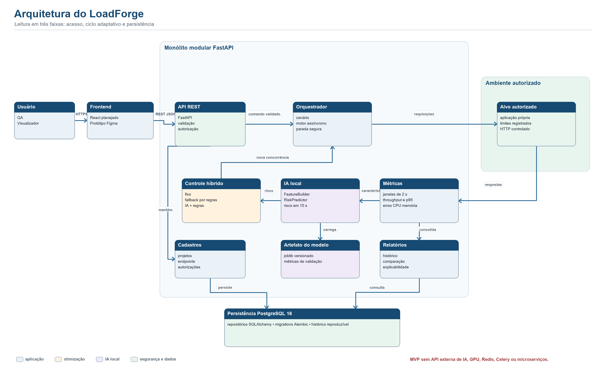
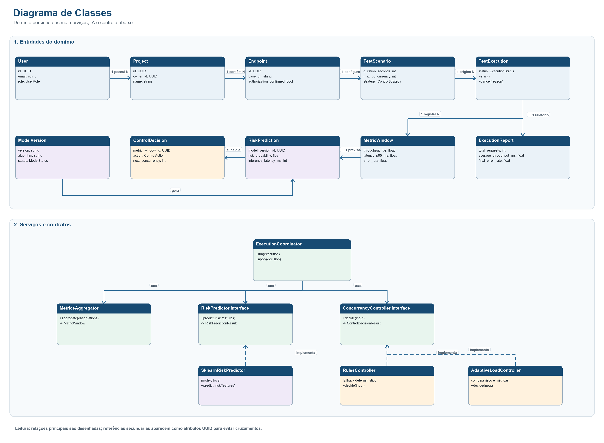
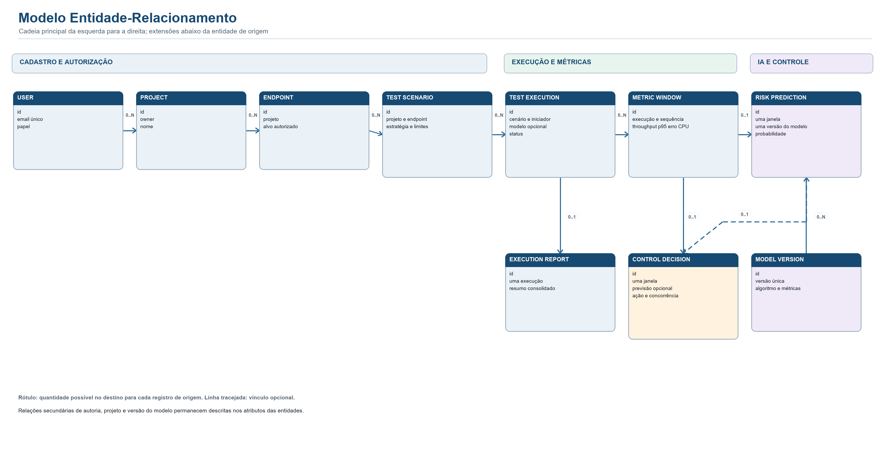
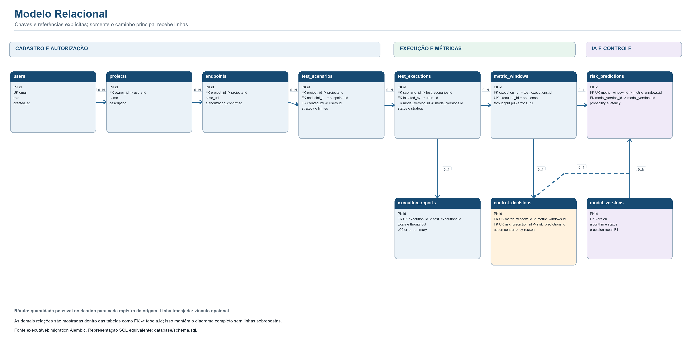
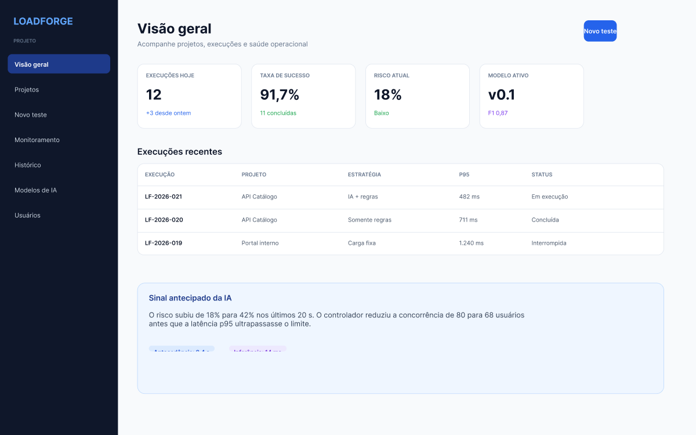
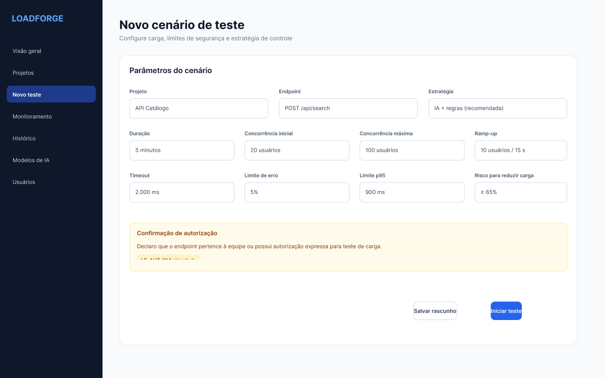
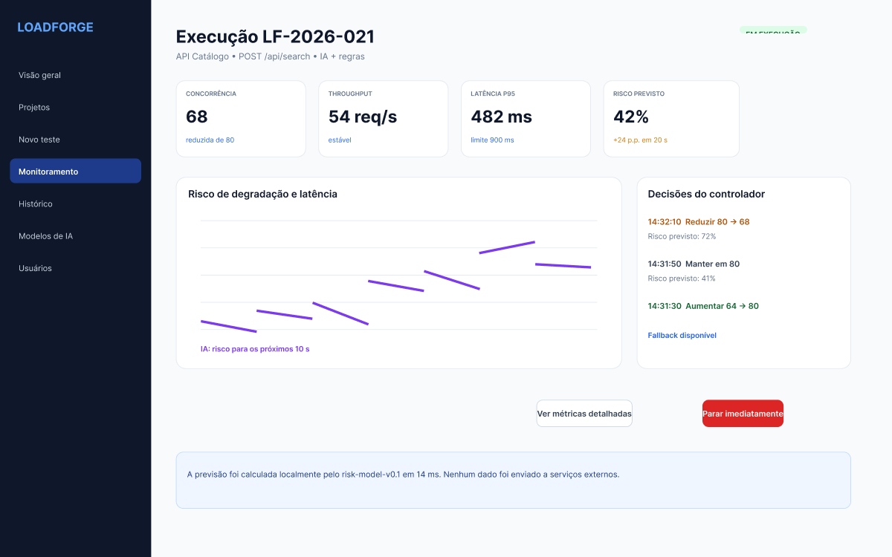
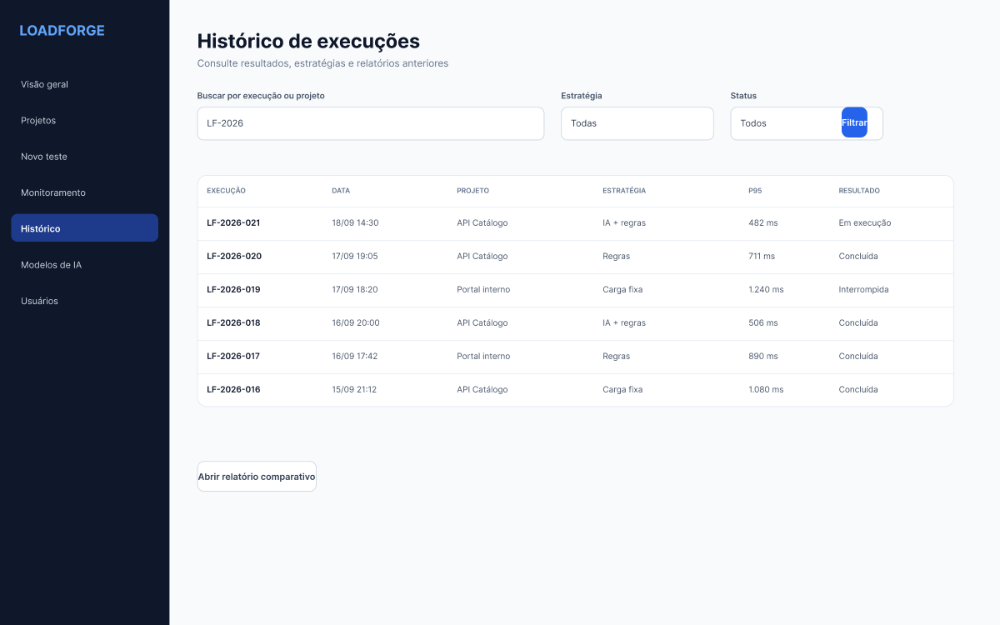

# Relatório Técnico da Sprint 02

## Identificação

**Projeto:** LoadForge — Stress and Resilience Evaluator  
**Turma:** CC8NB — Fábrica de Software 2026.2

| Integrante | Atuação no projeto |
|---|---|
| Camile Marcele Pereira de Araújo | Product Owner e Analista de QA |
| Ricardo Cezar Ottoni Assis de Almeida | Dados, infraestrutura e documentação |
| Aline Bianca Arantes da Silva | Desenvolvimento backend em Python |
| Emerson Wallace Barcelos de Araújo | Scrum Master e desenvolvimento backend |
| Cayo Vitor Fagundes | Desenvolvimento frontend e UI UX |

## Resultado da Sprint

A Sprint 02 transformou o planejamento funcional do LoadForge em uma base técnica para desenvolvimento. Foram definidos a arquitetura do sistema, as classes centrais, o modelo de dados, a estrutura inicial do PostgreSQL e o protótipo das telas. A integração entre métricas, previsão local de risco e controle adaptativo aparece de forma explícita em todos esses artefatos.

**Repositório:** [github.com/camimcl/sre-fabrica-de-software](https://github.com/camimcl/sre-fabrica-de-software)  
**Protótipo editável:** [LoadForge Sprint 02 no Figma](https://www.figma.com/design/isw6HZdCiomQvSekNScl9J)  
**Fontes e imagens dos diagramas:** [`docs/diagrams`](diagrams/README.md)

## Arquitetura do Sistema

O fluxo foi organizado em três faixas. A primeira reúne usuário, frontend, API e execução contra um alvo autorizado. A segunda mostra o ciclo adaptativo, no qual as respostas são agregadas em janelas, a IA local estima o risco e o controlador define a próxima concorrência. A terceira concentra cadastros, artefato do modelo, relatórios e persistência.

O monólito modular foi escolhido para manter execução, métricas, inferência e controle no mesmo processo durante o MVP. Essa decisão reduz a complexidade operacional e permite transações e depuração locais, sem eliminar a separação entre módulos. PostgreSQL é o único serviço externo obrigatório; o modelo de IA é carregado localmente e não depende de uma API de terceiros.

## Diagrama de Classes

O painel superior apresenta as entidades persistidas e o caminho principal entre usuário, projeto, endpoint, cenário, execução e métricas. As classes ligadas à IA e à decisão mantêm a rastreabilidade entre versão do modelo, previsão e ação do controlador. O painel inferior reúne o coordenador e os contratos de métricas, previsão e controle.

As interfaces `RiskPredictor` e `ConcurrencyController` foram adotadas para que o coordenador dependa de contratos estáveis, não de algoritmos específicos. Assim, o modelo treinado em scikit-learn pode ser substituído ou ficar temporariamente indisponível sem impedir o uso do controlador por regras. Referências secundárias são registradas como atributos UUID para manter o diagrama legível.

## Modelo Entidade Relacionamento

O MER separa cadastro e autorização, execução e métricas, e IA e controle. Uma execução pode ainda não possuir janelas, previsão, decisão ou relatório enquanto está pendente ou em processamento; por isso esses relacionamentos são opcionais no lado dos resultados. A versão do modelo permanece independente das execuções para permitir reutilização, comparação e aposentadoria controlada.

Essa estrutura registra tanto o estado operacional quanto as evidências experimentais. Uma decisão pode ser associada à previsão que a subsidiou, preservando a justificativa mesmo quando o fallback por regras é utilizado sem previsão.

## Modelo Relacional

O modelo relacional utiliza UUID como chave primária para evitar dependência de sequências compartilhadas entre módulos. Chaves estrangeiras preservam autoria, configuração, execução e origem das métricas. Restrições únicas garantem uma previsão e uma decisão por janela, além de um relatório consolidado por execução.

As cardinalidades foram conferidas contra `database/schema.sql`, a migration Alembic e os modelos SQLAlchemy. O banco permite que projetos ainda não possuam endpoints, que execuções ainda não possuam janelas e que janelas ainda não possuam decisões; o diagrama representa esses estados como `0..N` ou `0..1`. As dez tabelas, suas chaves e as relações apresentadas estão alinhadas à estrutura executável.

## Protótipo das Telas

O protótipo no Figma é uma representação inicial da interface e serve para validar navegação, hierarquia das informações e visibilidade do componente de IA. A aparência, os componentes e a distribuição dos elementos poderão mudar durante a implementação e os testes de usabilidade. As capturas abaixo registram a referência atual, enquanto o arquivo editável permanece disponível no [Figma](https://www.figma.com/design/isw6HZdCiomQvSekNScl9J).

### Dashboard

O dashboard reúne execuções recentes, risco atual e versão ativa do modelo. A síntese foi priorizada para que o usuário identifique rapidamente se existe degradação prevista antes de abrir os detalhes de uma execução.

### Novo Cenário

A configuração mantém carga, limites de segurança e estratégia no mesmo formulário. A confirmação de autorização recebe destaque porque o motor só deve executar testes contra alvos próprios ou expressamente autorizados.

### Monitoramento

O monitoramento exibe métricas observadas, risco previsto e decisões do controlador no mesmo contexto. Essa composição permite relacionar a ação sobre a concorrência aos sinais que a motivaram e mantém a parada imediata acessível.

### Histórico

O histórico oferece filtros por execução e estratégia e direciona ao relatório comparativo. O objetivo é permitir a análise dos modos fixo, por regras e assistido por IA em condições equivalentes.

## Banco de Dados e Estrutura do Repositório

O banco inicial contém dez tabelas para usuários, projetos, endpoints, cenários, versões do modelo, execuções, janelas de métricas, previsões, decisões e relatórios. A migration Alembic é a fonte executável; `database/schema.sql` apresenta a mesma estrutura em SQL; e os modelos SQLAlchemy representam o acesso da aplicação.

O repositório foi organizado como monorepo. `backend` contém a API, os módulos e as migrations; `database` contém a representação SQL e dados de desenvolvimento; `docs` reúne decisões, diagramas, relatório e protótipos; e `frontend` registra a transição do protótipo para a futura implementação. As instruções de preparação do ambiente e criação do banco permanecem no [README principal](../README.md).

## Conclusão

A base técnica cobre o fluxo completo entre configuração autorizada, execução, observação, previsão e controle. Os diagramas, o protótipo e o esquema executável usam os mesmos conceitos e relacionamentos, reduzindo ambiguidades para as próximas etapas de implementação.
